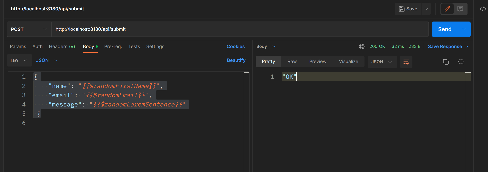
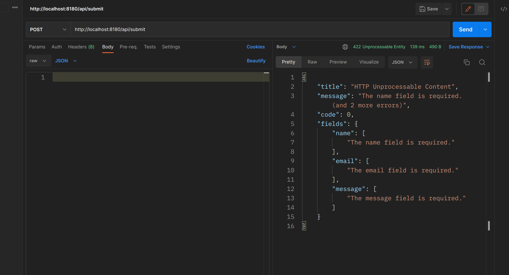
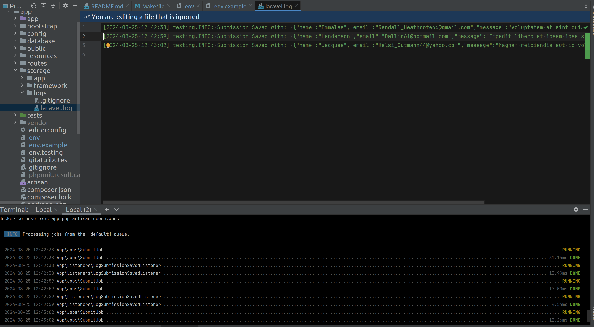

# Example

# Only First time:
### to build images, up containers, init app, run queue worker
```bash
make run
```
# OR step by step

### Build Images, Run Containers:
```bash
make build
make up
```

### Init App: 
install vendors, run DB migrations
```bash
make init
```

### Jobs Queue
By default, async handling of jobs
`QUEUE_CONNECTION=database`
- You should Run Queue Worker
```bash
make queue
```


### If you need SYNC jobs handling
You need:
- Change in .env file the variable to `QUEUE_CONNECTION=sync`
- Dont need to run `make queue`


# Now you can check endpoints
- health check endpoint: `GET http://localhost:8180/up`
- submit endpoint: `POST http://localhost:8180/api/submit`
- see logs in `app/storage/logs/laravel.log`

### Run, or stop, or down containers
```bash
make up
make stop
make down
```

### connect to PHP container:
```bash
make bash
```

### Run all tests:
```bash
make tests
```

### Clear app cashes:
```bash
make cc
```

### Clear log files:
```bash
make cl
```

### Display docker containers statuses:
```bash
make ps
```

### Available short commands in PHP container
- alias for php artisan: ```pa```
- composer install: ```ci```
- composer update: ```cu```
- clear app cashes: ```clear```
- clear log files: ```cl```
- run tests: ```pu```
- run fresh DB (and clear app cache): ```fresh```
- run fresh on test DB: ```fresh-test```

### Screenshots



